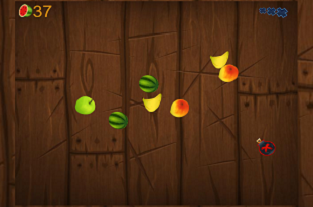

# FRUIT NINJA :kiwi_fruit:
**Fruit Ninja** the most popular fruit-slicing game in the world! This game is built completely using the **p5js** JavaScript library.


## GETTING STARTED :pencil:
To start playing:
  - Clone the repository 
    - Clone or download the repository **'Fruit-Ninja'** by clicking on the Clone or Download button
    - Start a local web server in the project folder, e.g. `python3 -m http.server`
    - Open `http://localhost:8000` and start playing!
    - **Note:** double-clicking `index.html` won't work, the sounds need a server
    
    **or**

  - Visit the link: [https://mathsyntax.github.io/ThirdSpace-Week1/](https://mathsyntax.github.io/ThirdSpace-Week1/)


## HOW TO PLAY? :interrobang:
**RULE 1:** Slice fruit :kiwi_fruit: <br/>
**RULE 2:** Don't slice bombs :bomb: <br/>
**RULE 3:** Don't let fruit fall - you have 3 lives :x: <br/>
**...and that is all you need to know to get started with the addictive Fruit Ninja action!!**

Click anywhere after game over to play again. Press **F** (or F11) for full screen.


## ABOUT p5js :speech_balloon:

### Basic sketch
  - This is the basic setup for a p5.js sketch- **setup()** and **draw()**. 
  - **Note:** p5.js will also require an empty HTML file that links to the p5.js library and your sketch file in the header.

    ```javascript
    function setup() {
      // setup stuff
    }
    function draw() {
      // draw stuff
    }
    ```
    
  - Alternatively, you could use the **preload()** function. 
  - If a preload() block exists it runs first, then setup() will wait until everything in there has completed before it gets run, so you can make use of things loaded in preload in setup and draw.
  
    ```javascript
    let img;
    function preload() {
      img = loadImage('img.jpg');
    }
    ```


## Game Snapshot :camera:



## REFERENCES :books:
[p5js Documentation](https://p5js.org/): A complete guide on how to use the **p5js** library.

